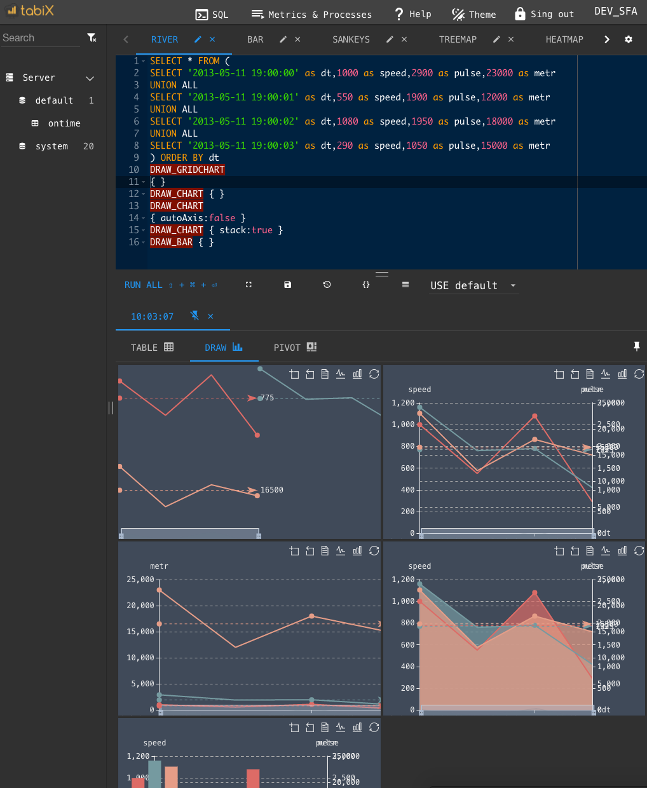

Open source simple business intelligence application and sql editor tool for Clickhouse.

## Install

Not need, open in browser http://ui.tabix.io/

### If need install

[Install to you host](https://tabix.io/doc/Install/)

[Use with Docker](https://tabix.io/doc/Install/#variant-5-from-docker)

## Documentation

https://tabix.io/doc/

## Draw charts & map

## Requirements

* Google chrome version up 55
* Clickhouse server version up v1.1.54164
* Not readonly CH user [note](https://tabix.io/doc/Requirements/#note)

## Roadmap

[Tabix roadmap board](https://github.com/smi2/tabix.ui/issues/12)

## Tabix changelog & news

[Tabix changelog & news in twitter](http://twitter.com/tabix_io)

## License

Copyright 2017 Igor Strykhar,Ivan Kudinov,SMI2 LLC and other contributors

Licensed under the Apache License, Version 2.0

Use components:
* [Ace.JS](https://ace.c9.io/) Copyright (c) 2010, Ajax.org B.V.
* [eCharts](https://github.com/ecomfe/echarts) Copyright (c) 2017, Baidu Inc.
* [Handsontable](https://github.com/handsontable/handsontable)
* [Lodash](https://github.com/lodash/lodash) Copyright JS Foundation
* [pivottable](https://github.com/nicolaskruchten/pivottable)
