Tabix is open source simple BI and sql editor tool for Clickhouse. 
==================================================================


Tabix -- Что это ?
Tabix -- Откуда он появился ?


## Install and run


Для старта ипользованая Tabix, нужно подкорректировать настройки Clickhouse. 

Нужно разрешить подключаться с вашего IP адресса к CH, добавив listen_host в `/etc/clickhouse-server/config.xml` 

```xml
<listen_host>111.222.111.222</listen_host>
```


Далее заходим на `ui.tabix.io`


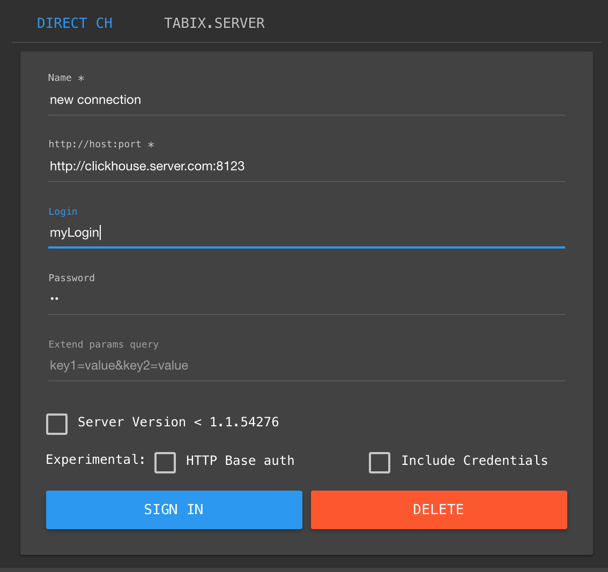

Заполняем:
* В поле url ваш адресс к серверу СH `http://clickhouse.ip:8123`
* Login & Password
* Другие парамерты оставдяем пустми


Основной экран Tabix
==================================================================
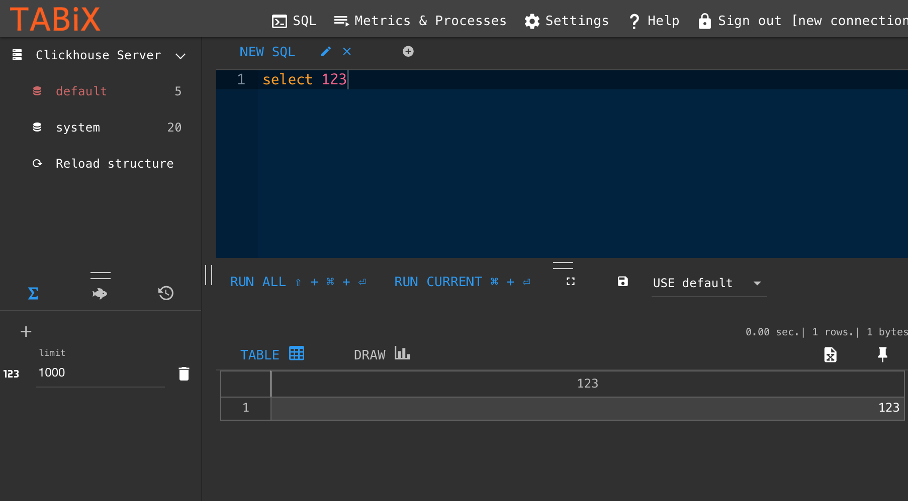


В левой части расположенно дерево обьектов

В центральной части SQL редактор,

В нижней части результат


Todo: расписать про меню сверху

Todo: Какие горячие клавиши есть глобальные

Основной экран Tabix - Дерево
==================================================================

Todo: про дерево - что поддержка правой кнопки,


Todo: про дерево - что можно кликнуть на поля

Todo: про дерево - Для чего нужна кнопка Reload structure

Todo: про дерево - Как открыть быстро таблицу для просмотра, сделав DoubleClick
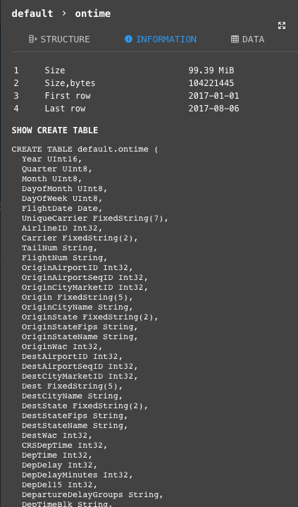


Display the number of tables at the database

The icon of the table depends on its engine

List of fields in the table and inserting the field when clicking in the editor


Основной экран Tabix - Редактор
==================================================================

## Auto complete

Как работает автокомплит


## Multiquery in editor

Todo: - Как использовать `;;`


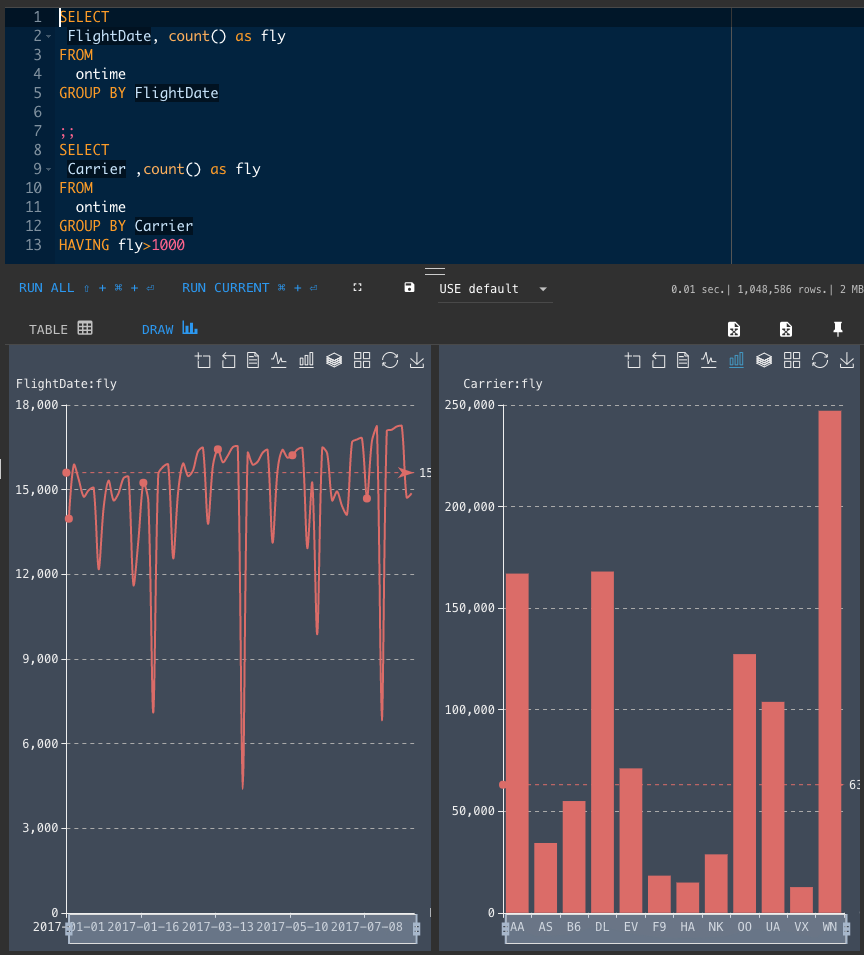


## Editor right click menu

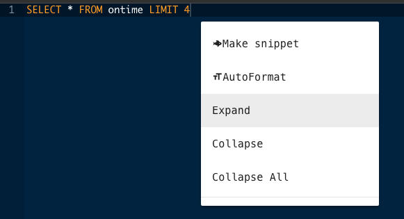


## Tabix HotKeys

Какие горячие клавиши есть в редакторе

| Windows/Linux                  | Mac                            | Action                         |
|:-------------------------------|:-------------------------------|:-------------------------------|
| Ctrl-Enter | Command-Enter | Exec current query under cursor |
| Shift-Ctrl-Enter | Shift-Command-Enter | Exec all query in current editor |
| Ctrl-Shift-F | Command-Shift-F | AutoFormat code |
| Alt-Shift-Ctrl-Left | Command-Alt-Shift-Right | Goto Next tab |
| Alt-Shift-Ctrl-Right | Command-Alt-Shift-Right | Goto Prev tab  |
| Shift-Ctrl-[0...9] | Command-Shift-[0...9] | Goto tab number |
| Shift-Ctrl-+ | Command-Shift-+ | Fold code |
| Shift-Ctrl-- | Command-Shift-- | Unfold code |
| Alt-L, Ctrl-F1 | Command-Option-L, Command-F1 | Fold selection |
| Alt-Shift-L, Ctrl-Shift-F1 | Command-Option-Shift-L, Command-Shift-F1 | Unfold |
| Alt-0 | Command-Option-0 | Fold all |
| Alt-Shift-0 | Command-Option-Shift-0 | Unfold all |

### Line Operations

| Windows/Linux                  | Mac                            | Action                         |
|:-------------------------------|:-------------------------------|:-------------------------------|
| Ctrl-D | Command-D | Remove line |
| Ctrl-Y | Command-Y | Remove line |
| Alt-Shift-Down | Command-Option-Down | Copy lines down |
| Alt-Shift-Up | Command-Option-Up | Copy lines up |
| Alt-Down | Option-Down | Move lines down |
| Alt-Up | Option-Up | Move lines up |
| Alt-Delete | Ctrl-K | Remove to line end |
| Alt-Backspace | Command-Backspace | Remove to linestart |
| Ctrl-Backspace | Option-Backspace, Ctrl-Option-Backspace | Remove word left |
| Ctrl-Delete | Option-Delete | Remove word right |


### Find/Replace

| Windows/Linux                  | Mac                            | Action                         |
|:-------------------------------|:-------------------------------|:-------------------------------|
| Ctrl-F | Command-F | Find |
| Ctrl-H | Command-Option-F | Replace |
| Ctrl-K | Command-G | Find next |
| Ctrl-Shift-K | Command-Shift-G | Find previous |


### Other

| Windows/Linux                  | Mac                            | Action                         |
|:-------------------------------|:-------------------------------|:-------------------------------|
| Ctrl-Shift-U | Ctrl-Shift-U | Change to lower case |
| Ctrl-U | Ctrl-U | Change to upper case |
| Ctrl-/ | Command-/ | Toggle comment |
| Ctrl-Shift-D | Command-Shift-D | Duplicate selection |


More hot keys  https://github.com/ajaxorg/ace/wiki/Default-Keyboard-Shortcuts#line-operations


Todo: - Зачем переключатель Базы


Minimizes brackets and subqueries

The list of functions is loaded based on the capabilities of the server


Основной экран Tabix - Результаты запросов - Таблицы
==================================================================

Todo: - выгрузка в эксель / redmine /


Redmine format data:
```
 | Carrier | DestCityName |
 | EV | Chicago, IL |
 | DL | Minneapolis, MN |
 | WN | Dallas, TX |
 | WN | Chicago, IL |
 | B6 | Boston, MA |
 | EV | Atlanta, GA |
 | AA | Philadelphia, PA |
```


Todo: - Трансформация / переворот таблицы


Todo: - стилизация ячеек и форматирования

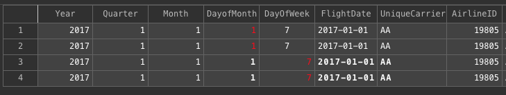

Todo: - расчет median / avg по выделенным ячейкам

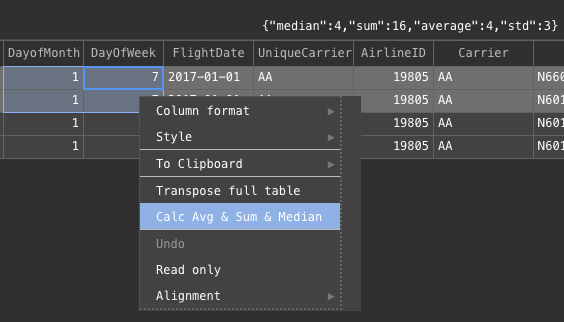


Основной экран Tabix - Результаты запросов - Графики
==================================================================

Воспользуемся DataSet OnTime:  https://clickhouse.yandex/docs/ru/single/index.html#ontime


Todo: - пример как используются простейшие графики - как tabix пытается подстроиться под данные


```sql


SELECT
 FlightDate, count() as fly
FROM
  ontime
GROUP BY FlightDate
```
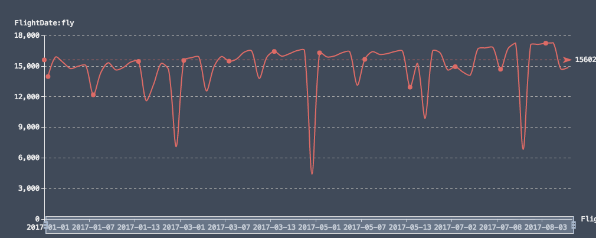


```sql
SELECT
 Carrier ,count() as fly
FROM
  ontime
GROUP BY Carrier
HAVING fly>1000

```
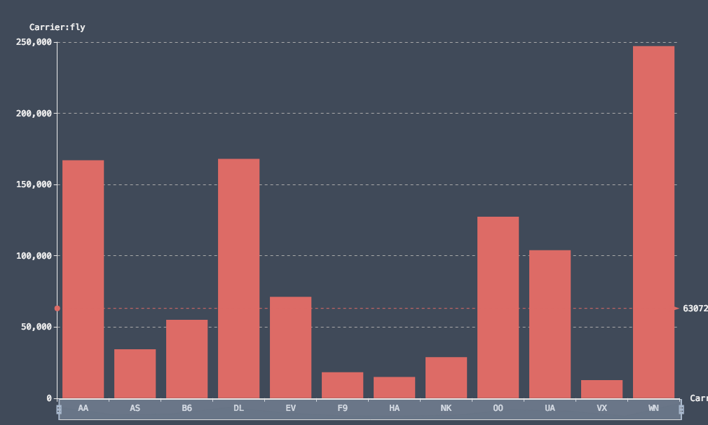

```sql
SELECT
 FlightDate, Carrier ,count() as fly
FROM
  ontime
GROUP BY FlightDate,Carrier
HAVING fly>1000
```
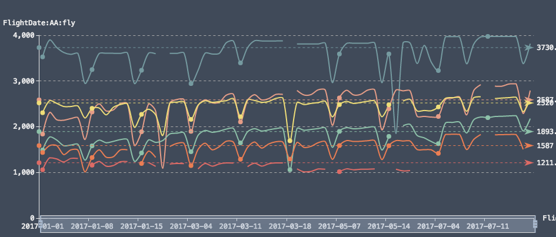


Todo: - Пару примеров как строить сложные графики


// DRAW_SANKEYS https://tabix.io/doc/draw/Draw_Sankeys/


```sql
SELECT
 Carrier , DestCityName ,count() as fly
FROM
  ontime
GROUP BY Carrier,DestCityName
HAVING fly>5000
DRAW_SANKEYS  "Carrier.fly.DestCityName"
```

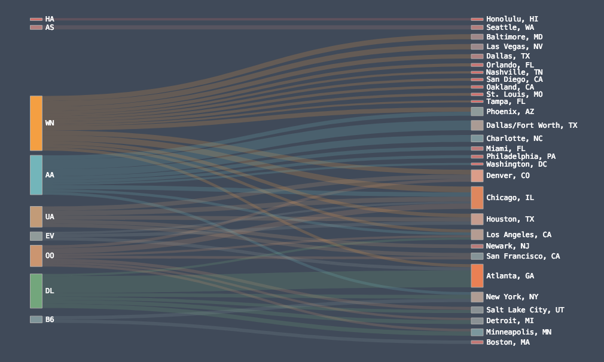


// Draw Treemap : https://tabix.io/doc/draw/Draw_Treemap/


```sql
SELECT
 Carrier , DestCityName ,count() as fly
FROM
  ontime
GROUP BY Carrier,DestCityName
HAVING fly>1000
DRAW_TREEMAP  "Carrier.DestCityName"
```
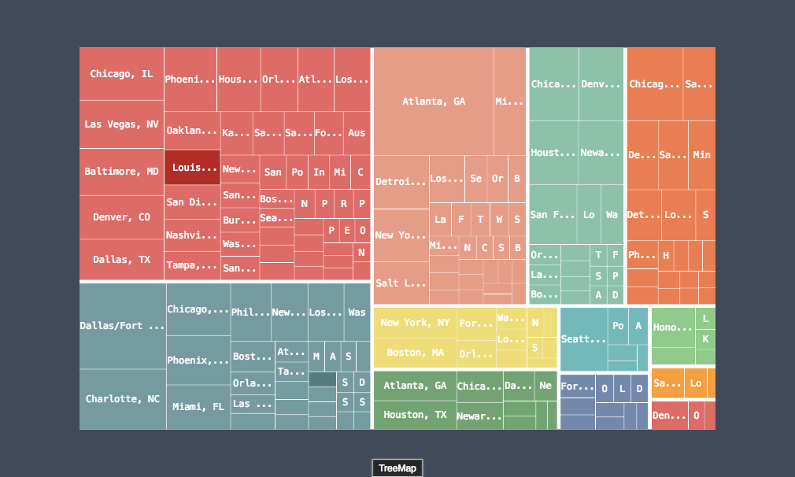
```sql

SELECT
 FlightDate, count() as fly
FROM
  ontime
GROUP BY FlightDate
DRAW_CALENDAR {}
```
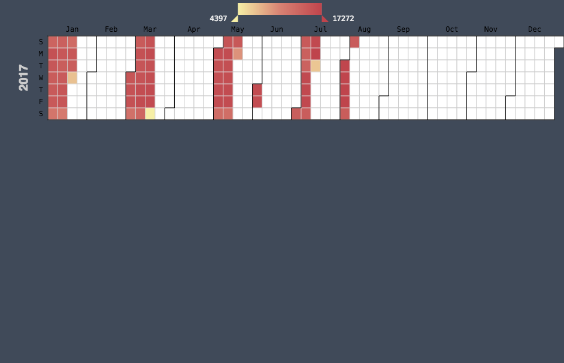
